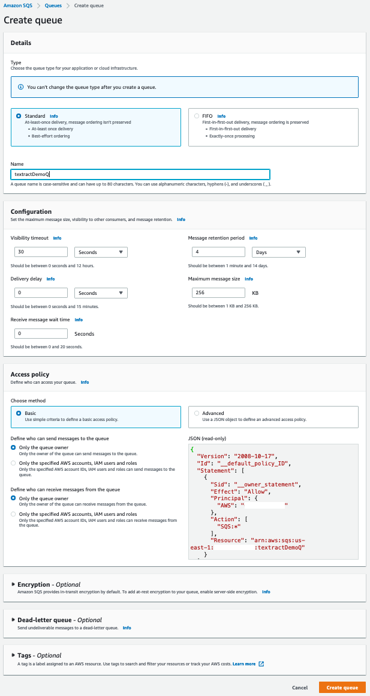
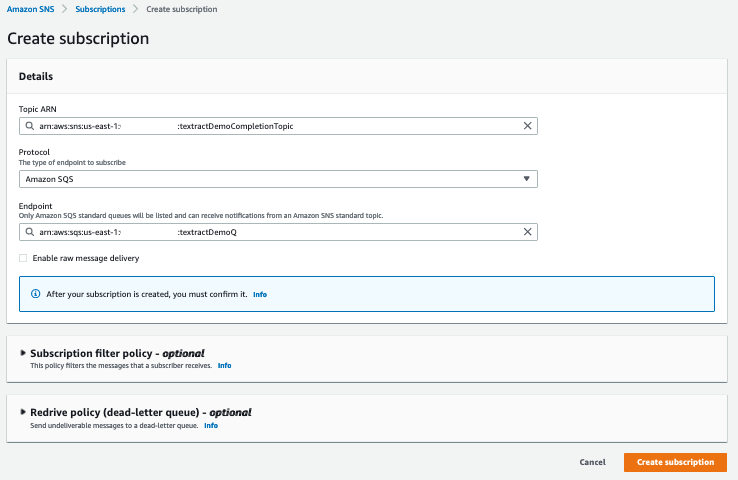
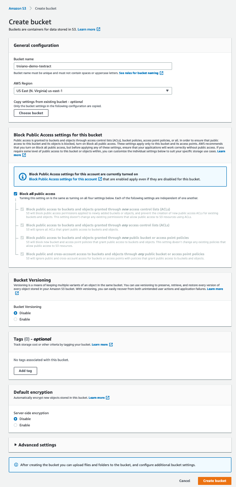
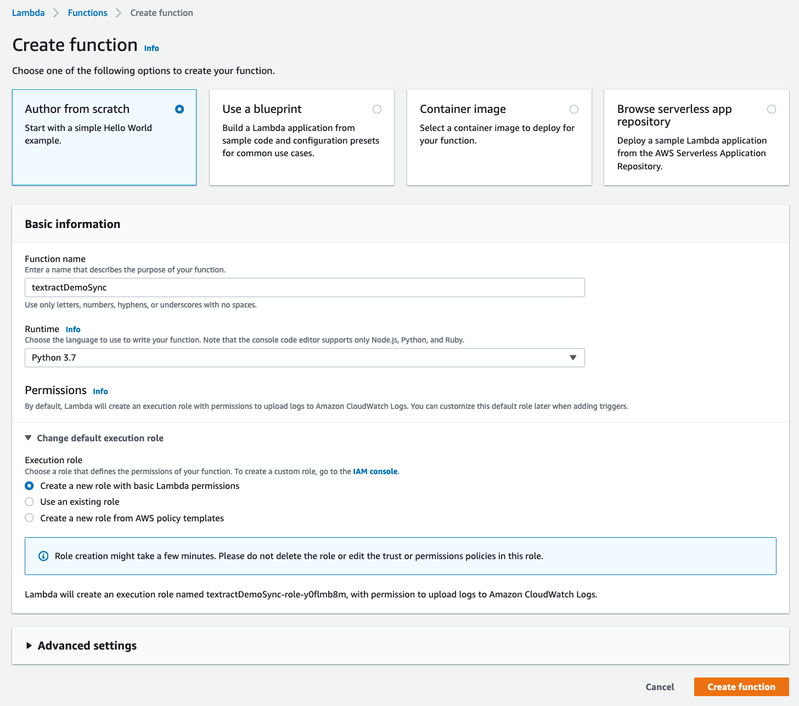
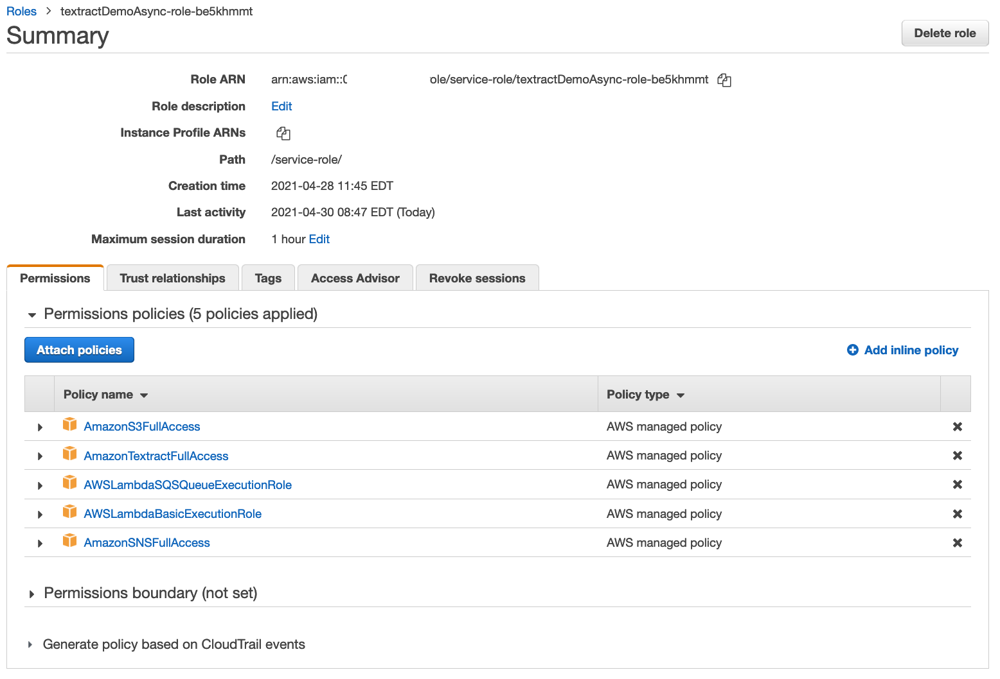

# aws-demo-textract

## Overview
This demo is targeted toward SAs presenting to customers. Any overview slides used at the beginning can be tailored to the specific case. Initial version will cover Detecting and Analyzing Text for Single-paged documents using Textract's Synchronous Operations.

#### Future plans:
- Add a Deadletter Queue
- Add VPC endpoints, as many of our customers prefer that path
- Part II will be added to include the modifications and additional components to support Multipage documents using the Asynchronous Operations with a 2-3 page .pdf example.
- DynamoDB can be added to store document metadata, both in its incoming and processed states.

The overall architecture follows the [AWS Sample Code for Large scale document processing with Amazon Textract](https://github.com/aws-samples/amazon-textract-serverless-large-scale-document-processing), and is tailored for a demo to fit within a 1-2 hour customer call versus a longer workshop format. The Sample Code repository has a more complete solution build customers can use for reference. Where it uses AWS CDK to deploy, this demo walks through building the base components using the console. The code provided below is for demonstative purposes only and does not include a production-ready user experience and error handling.

#### Prerequisites
- AWS Account
- [AWS CLI installed](https://docs.aws.amazon.com/cli/latest/userguide/cli-chap-install.html)
- [AWS profile configured for access](https://docs.aws.amazon.com/cli/latest/userguide/cli-configure-profiles.html)
- [Python 3 installed](https://docs.python.org/3.8/using/unix.html#getting-and-installing-the-latest-version-of-python) or optionally, if you use conda, [create an environment and activate it](https://conda.io/projects/conda/en/latest/user-guide/tasks/manage-environments.html#)
  ```
  conda create -n aws-demo-textract python=3.8
  conda activate aws-demo-textract
  ```

## Architecture
**from the above sample GitHub repository*<br />


## Architecture Components and Workflow
1. The process starts with a sample file uploaded to S3. For this we use a simple python script.
2. Once uploaded, the S3 Bucket uses an Event Notification to send a message to an Amazon SQS queue.
3. This SQS queue is set as a trigger for the (Textract Synchornous Operations) Lambda function
4. The Lambda function obtains the S3 Bucket and file from the SQS queue message and calls Textract's analyze_document API
5. It next calls the Document function from a [Textract Response Parser](https://github.com/aws-samples/amazon-textract-response-parser) (referenced in the [Textract documentation](https://docs.aws.amazon.com/textract/latest/dg/other-examples.html)) that processes the Textract output, returning it as a custom Document object containing pages as Python List objects. These lists make it easier to parse the document into a readable format. 
6. The function parses the output into a readable summary.
7. Finally it saves the output and summary in two files
    - A text file with the readable summary
    - A json file with the Textract Analyze output
8. A simple python script reads the completion message from the SQS queue. A customer's application can poll this queue for completed documents or use one or more of SNS' protocols to push completion notification.
9. If DynamoDB is used for document metadata, the completion state and any relevant data can be updated.

## Create an Standard SQS Queue for S3 Uploads
1. Name = textractDemoS3UploadQ
2. Set the visibility timeout to 60 sec (10x the function timeout, from below)
3. Leave everything as their default values
4. Note the ARN to be used in the Event Notification configuration for the S3 Bucket<br /><br />


<br /><br />

## Create an Standard SQS Queue for Completion Message
1. textractDemoQ for .png files in the 'uploads' prefix
2. Leave everything as their default values
3. Note the ARN to be used in the SNS Topic Subscription<br /><br />


<br /><br />

## Create the SNS Topic for Completion Notification
1. Type = Standard
2. Name = textractDemoCompletionTopic
3. Leave everything as their default values<br /><br />


<br /><br />

## Create a Subscription to the SNS Topic
1. Protocol = Amazon SQS
2. Endpoint = the ARN for the SQS queue, textractDemoQ<br /><br />


<br /><br />

## Update the Completion Queue Access Policy
Add the following as an additional statement
```
    {
      "Sid": "topic-subscription-arn",
      "Effect": "Allow",
      "Principal": {
        "AWS": "*"
      },
      "Action": "SQS:SendMessage",
      "Resource": "arn:aws:sqs:us-east-2:<Account Number>:textractDemoQ",
      "Condition": {
        "ArnLike": {
          "aws:SourceArn": "arn:aws:sns:us-east-2:<Account Number>:textractDemoCompletionTopic"
        }
      }
    }
```

## Create an S3 Bucket
1. Bucket name = troiano-demo-textract
2. Keep everything as their default values<br /><br />



3. create a folder 'uploads'
4. create a folder 'processed'
5. create a folder 'processed/summaries'
6. create a folder 'processed/json'<br /><br />

<br />


## Add Access to SQS for the S3 Bucket
**Needs to be added before the Event Notification step below or S3 will not be able to validate its access*
1. Open the console for the textractDemoS3UploadQ queue
2. Add the policy below under the Access policy tab. Confirm the bucket name and queue name in the policy match what was used in creating them and populate the *account number* placeholder.

```
{
  "Version": "2012-10-17",
  "Statement": [
    {
      "Sid": "s3-upload-access",
      "Effect": "Allow",
      "Principal": {
        "Service": "s3.amazonaws.com"
      },
      "Action": "SQS:SendMessage",
      "Resource": "arn:aws:sqs:us-east-1:<account number>:textractDemoS3UploadQ",
      "Condition": {
        "ArnLike": {
          "aws:SourceArn": "arn:aws:s3:::troiano-demo-textract"
        }
      }
    }
  ]
}
```
<br /><br />

## Add the S3 Event Notification
1. Go to the S3 Console and open click on the troiano-demo-textract bucket
2. create an event notification under the 'properties' tab called 'textractDemoS3UploadComplete'
   - folder = uploads/
   - Suffix = .png
   - events = Put and Multipart upload completed
   - Destination = SQS queue, textractDemoS3UploadQ<br /><br />

<br /><br />

## Lambda Layer Creation
This section adds the example Textract Parser code and boto3 library, following instructions on the Textract Parser example GitHub repo, mentioned above and in the Textract documentation section, [Creating an AWS Lambda Function](https://docs.aws.amazon.com/textract/latest/dg/lambda.html).
1. Create a folder, python-layer and install the packages
    ```
    pip install boto3 --target python/.
    python -m pip install amazon-textract-response-parser --target python
    zip python-layer.zip -r python/
    ```
2. Open the Lambda console and choose Layers from the left menu
3. Create a layer<br /><br />

<br /><br />

## Create the Synchronous Operations Lambda Function
1. Create a new function called textractDemoSync
2. Author from Scratch
3. Runtime = Python 3.7
4. Permissions = Create a new role
   <br />**we'll update the roles permissions later*<br /><br />

<br /><br />

4. In the Code tab, replace the example function with the following code.
    - Update the SNS Topic's Endpoint ARN, toward the bottom
5. Configuration tab, choose General configuration and set the timeout to 10 sec
<br /><br />

<details>

<summary>Lambda Function: Click to expand...</summary><br /><br />

```python
import json
import boto3
import os
import urllib.parse
from datetime import datetime
from trp import Document

def lambda_handler(event, context):
    
    for record in event['Records']:
        
        # Get the bucket and filename (key) from the event and set the output filenames
        msg = json.loads(record['body'])
        eventBucket = msg['Records'][0]['s3']['bucket']['name']
        eventKey = urllib.parse.unquote_plus(msg['Records'][0]['s3']['object']['key'])
        uploadedFullFilename = os.path.basename(eventKey)
        uploadedFilename = os.path.splitext(uploadedFullFilename)[0]
        jsonOutputPrefix = "processed/json/"
        summaryOutputPrefix = "processed/summaries/"
        outputJsonFile1 = jsonOutputPrefix + uploadedFilename + ".json"
        outputJsonFile2 = summaryOutputPrefix + uploadedFilename + ".txt"
        
        # print the bucket and filename to the application log
        print("Bucket: " + eventBucket)
        print("Path & Filename: " + eventKey)
        print("JSON output in " + outputJsonFile1)
        print("Summary output in " + outputJsonFile2)
        
        # Create the Textract session and call analyze_document()
        client = boto3.client('textract')
        response = client.analyze_document(
            Document = {'S3Object': {'Bucket': eventBucket, 'Name': eventKey}},
            FeatureTypes = ['TABLES','FORMS']
        )
        
        # Parse JSON response from Textract using amazon-textract-response-parser
        # https://github.com/aws-samples/amazon-textract-response-parser
        doc = Document(response)
        parsedOutput = ''
    
        # Iterate over elements in the document (print output appears in the application log)
        for page in doc.pages:
            
            # Print lines and words
            for line in page.lines:
                parsedOutput = parsedOutput + '-\nline: ' + line.text + ' (' + str(line.confidence) + ')\n'
                parsedOutput = parsedOutput + '-----------------------------------------------------\n'
                for word in line.words:
                    parsedOutput = parsedOutput + 'word: ' + word.text + ' (' + str(word.confidence) + ')\n'
        
            # Print tables
            for table in page.tables:
                parsedOutput = parsedOutput + '-\ntable\n'
                parsedOutput = parsedOutput + '-----------------------------------------------------\n'
                for r, row in enumerate(table.rows):
                    parsedOutput = parsedOutput + '\n'
                    for c, cell in enumerate(row.cells):
                        parsedOutput = parsedOutput + cell.text.replace(',', '').strip() + ','
                parsedOutput = parsedOutput + '\n'
        
            # Print fields
            parsedOutput = parsedOutput + '-\nfields\n'
            parsedOutput = parsedOutput + '-----------------------------------------------------\n'
            for field in page.form.fields:
                parsedOutput = parsedOutput + field.key.text + ', ' + field.value.text + '\n'
            parsedOutput = parsedOutput + '\n'
    
        # Print to the application log
        print(parsedOutput)
        
        # Write JSON response to a file in s3
        json2s3(json.dumps(response['Blocks']), eventBucket, outputJsonFile1)
        json2s3(parsedOutput, eventBucket, outputJsonFile2)
        
        # Post notification that the file processing is completed.
        completionTime = datetime.now()
        snsMessage = completionTime.strftime("%d/%m/%Y %H:%M:%S") + ": File " + uploadedFullFilename + " has been processed."
        print(snsMessage)
        response = textract2Sns(snsMessage)
        
        return {'statusCode': 200}
        
def json2s3(output_body, output_bucket, output_file):

    s3 = boto3.client('s3')
    s3.put_object(
        Body = output_body.encode('utf-8'),
        Bucket = output_bucket,
        Key = output_file
    )

    return {'statusCode': 200}

def textract2Sns(output_body):

    try:
        sns = boto3.client('sns')
        response = sns.publish(
            TopicArn = "arn:aws:sns:us-east-1:<Account Number>:textractSnsDemo",    
            Message = output_body 
        )
        return {'statusCode': 200}
        
    except Exception as e:
        print(e)
        return(e)

```
</details>
<br /><br />

## Add the Lambda Layer 
In the Layers section choose Add Layer<br /><br />

<br /><br />

## Update the Lambda Execution Role
Update the role permissions by choosing Permissions from the list under the Configuration tab<br /><br />

<br /><br />

## Add the SQS Event Trigger
Add a Trigger to the Lambda function<br /><br />

<br /><br />

## S3 Upload
- Be sure to save the Lambda code and click Deploy
- After running, go to CloudWatch and look at the Lambda function's Log Group for execution results
```
import boto3

# AWS Profiles contain the region and output format (in .aws/config) and the 
# access and secret keys (in .aws/credentials)
session = boto3.session.Session( profile_name = 'aws-main' )

# Define the S3 rersource
s3 = session.resource( 's3' )

# File to upload
demoFile = 'demofiles/employmentapp.png'

# Bucket to which the file will be uploaded
demoBucket = 'troiano-demo-textract'

# Key includes the filename and s3 prefixes (folders) without a preceeding '/'
demoKey1 = 'uploads/employmentapp1.png'

s3.meta.client.upload_file(
    Filename = demoFile,
    Bucket = demoBucket,
    Key = demoKey1
)
```

## Pull the Completion Message from SQS
```
import boto3
import json

# The AWS Profile contains the region and output format (in .aws/config) and the 
# access and secret keys (in .aws/credentials)
session = boto3.session.Session( profile_name = 'aws-main' )

# Get the service resource
sqs = session.resource( 'sqs' )

# Get the queue
queue = sqs.get_queue_by_name(QueueName = 'textractDemoQueue')

# Process messages by printing out body and optional author name
messages = queue.receive_messages()

for message in messages:
    msg = json.loads(message.body)
    print(msg['Message'])
    message.delete()
```

## Run the Demo by Uploading a File to be Processed
```
python file-upload.py
```
